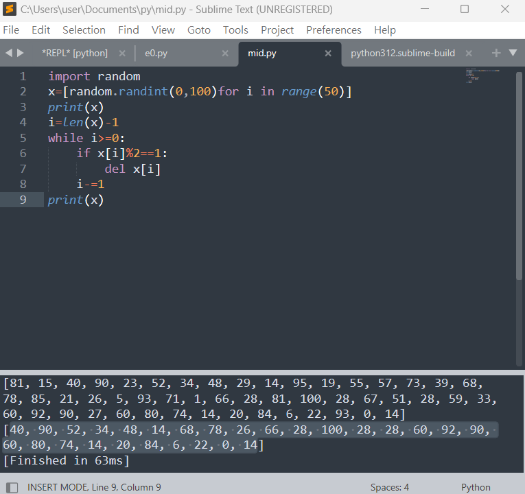

# 南華大學Python程式設計 期中報告第五題
# 編寫程式，生成一個包含50個隨機整數的清單，然後刪除其中所有奇數。
# 11124208 王品雯 11124209 蔡岱伶
## 生成一個包含50個隨機整數，範圍0~100的清單
```
import random
x=[random.randint(0,100)for i in range(50)]
print(x)
```
## 刪除其中所有奇數
```
i=len(x)-1
while i >= 0:
  if x[i] % 2 == 1:
    del x[i]
  i-=1
print(x)
```
# 實作


